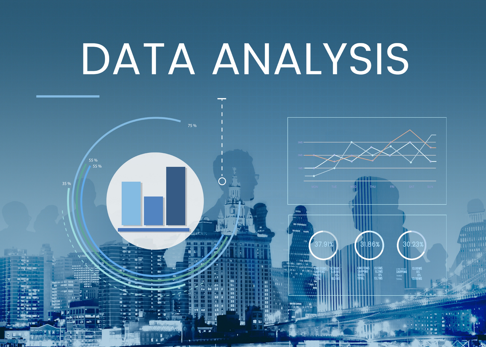

# 🧭 My Portfolio Navigator

Every data analyst starts somewhere, and this portfolio reflects my ongoing learning process.

## 🔗 Sections

- [SQL](#sql)
- [Tableau](#python)

## SQL

  
📌 COVID-19 Data Analysis

  **Description:** Analyzed COVID-19 cases, deaths, and vaccinations using SQL queries.  

  🔗 [View Project](https://your-link.com)

### 🌟 [COVID-19 Data Analysis](#)
**Description:** A comprehensive analysis of COVID-19 trends using SQL, focusing on vaccinations, cases, and deaths.

## My Projects

| Project | Link |
|---------|------|
|  | [View Project](#) |
|  | [View Project](#) |
|  | [View Project](#) |

## My Projects Timeline

- **[COVID-19 Data Analysis](https://your-link.com)**  
  A SQL-based analysis of COVID-19 trends.

- **Sales Data Exploration**  
   SQL analysis to uncover insights in sales trends.

- **HR Employee Retention**  
  Exploring factors affecting employee turnover with SQL.

<a href="#project-link" class="button">View COVID-19 Analysis</a>
<a href="#project-link" class="button">View Sales Data</a>

## My Projects

| Project | Link |
|---------|------|
|  | [COVID](#) |
|  | [DATA JOBS](#) |
|  | [STUDENTS](#) |
